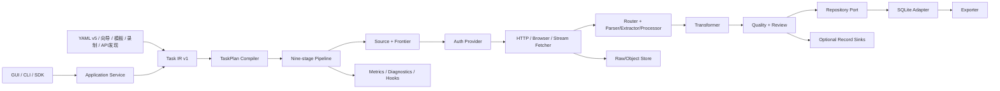

# OmniCrawler 0.8.0 架构

## 原则

站点差异放在 source/template，传输差异放在 fetcher，语法差异放在 parser/extractor/processor，业务清洗放在 transformer，交付差异放在 exporter/record sink。Pipeline 只负责编排、安全、状态、质量、资源和生命周期。

## 运行模型

1. 配置加载、迁移、环境变量与 secret 引用解析；所有输入先转换为 Task IR。
2. 计划编译器执行能力、安全、资源和冲突检查，生成说明、权限清单、稳定哈希。
3. 注册内置组件，预检并加载本地插件。
3. ResourceGuard 首检，创建 run，执行 `before_run`。
4. source 生成种子并写入 SQLite frontier。
5. worker claim 请求；认证、范围、DNS、robots、限速后 fetch。
6. HTTP 结果按证据决定是否升级浏览器；浏览器子请求继续做网络安全检查。
7. 原始响应、接口证据与附件写对象存储；响应元数据写 SQLite。
8. 提取、transform、质量、记录存储、链接发现和队列推进。
9. PDF 子流程、导出、指标、summary 与 `after_run`。

单 URL 异常隔离；运行级异常正确结束 run 并保留恢复状态。

## 状态与幂等

- 请求指纹由 method、规范 URL、body 哈希和 kind 构成。
- 响应用内容哈希检测变更，原始版本可归档。
- SQLite WAL 是单机恢复权威；claim/mark/retry 为事务边界。
- 外部记录 sink 使用稳定 record ID 幂等更新。
- `reprocess` 只在原始归档完整且安全时重置派生阶段，并写审计事件。

## 插件边界

Registry 分类型保存 factory；同类型名称唯一。工厂支持 `(config, options)`、`(config)` 或无参数。插件元数据负责 API/核心版本、权限、依赖、许可、适用域名、fallback 与资源提示。失败开放是配置选择，不由插件自行吞错。

## 兼容性

- 配置迁移发生在内存；显式 migrate 输出副本。
- legacy 平面模板继续发现。
- GUI 以深层覆盖方式更新字段，未知/扩展设置往返保留。
- 原 CLI 和 PDF 独立入口保留。

## 依赖规则

- GUI 主窗口只组合控制器；控制器只调用 Application Service。
- Application Service 返回普通不可变事件/字典 DTO，不返回 Qt、SQLite 连接或 Pipeline 实例。
- Task IR 与计划编译器不依赖 GUI、CLI、数据库或网络实现。
- 持久化由 Repository 端口隔离；SQLite 是默认适配器而不是公共接口。
- Pipeline 按 plan/policy/fetch/archive/parse/filter/attachments_pdf/quality/export 顺序执行。
